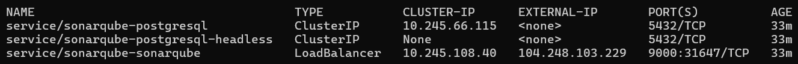
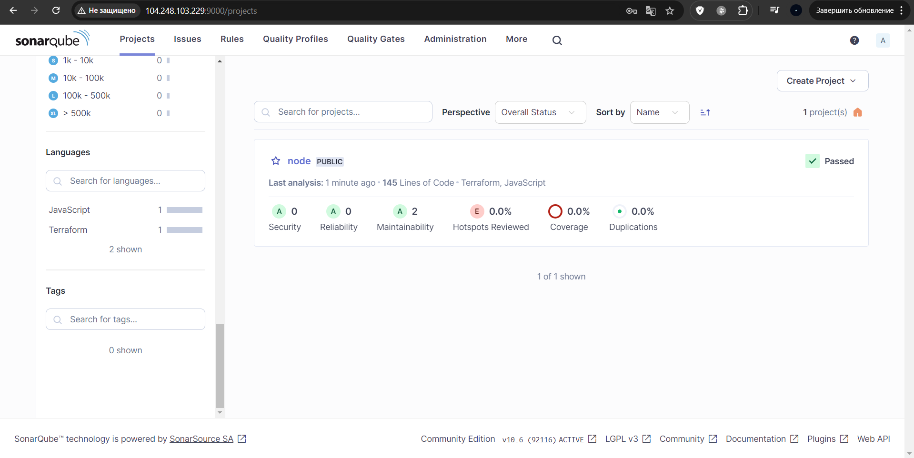
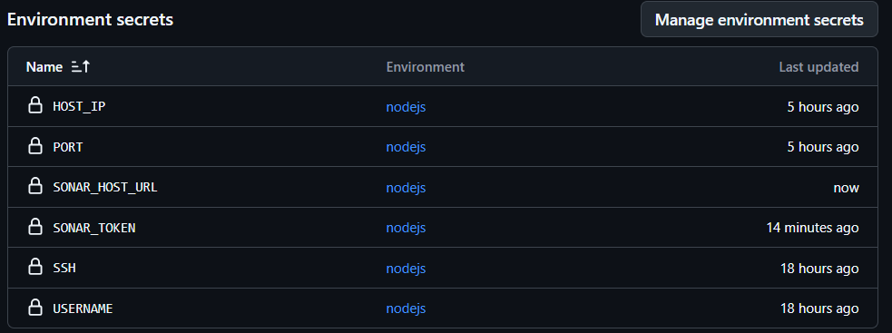
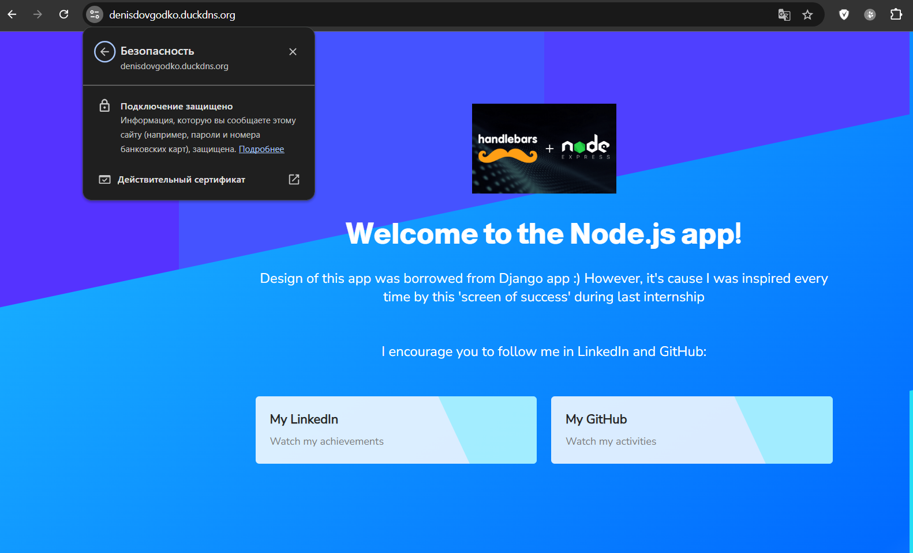

## Node.js + Express.js web app with CI/CD via GitHub Actions -> AWS EC2 with Terragrunt
## How to reproduce:
#### I. Fork repository
#### II. Create AWS IAM user, issue API token
You need to create .env in working directory file and provide here your access and secret AWS IAM user's API token
```
AWS_ACCESS_KEY=YOUR_IAM_USER_ACCESS_TOKEN
AWS_SECRET_KEY=YOUR_IAM_USER_SECRET_TOKEN
GITHUB_REPO=https://your-github-username/your-project-name
EMAIL=your-email@example.com
DOMAIN=your.domain
```
#### III. Set up infrustructure with terragrunt
Go to terragrunt/production folder. Use next command:
```
terragrunt run-all apply
```
It will setup VPC and one EC2 instance in us-east-1 zone. It will perform bash script from user-data to presetup your system. You should get credentials to server in shell where you assigned infra deployment after completing.
To destroy infra, use:
```
terragrunt run-all destroy
```
#### IV. SonarQube deploy
You need to deploy sonarqube server & database. I chose option to create k8s cluster with Sonarqube helm chart:
```
helm repo add sonarqube https://SonarSource.github.io/helm-chart-sonarqube
kubectl create namespace sonarqube
helm upgrade --install -n sonarqube sonarqube sonarqube/sonarqube -f .\values.yaml
``` 
Your external IP will appear here:
```
kubectl get services -n sonarqube
```

After that, visit your http://external-ip:9000, login with admin/admin. Create sonar user token in account security settings

#### V. Credentials transfer
As soon infrastructure setting up will complete, it will file with ssh key appear in working directoty. Copy this key. Open repository settings in github. Create secrets environment called 'nodejs'. Create next secrets in github according to terragrunt outputs:
 
Also you may connect IP adress of your instance with your available domain(I use free duckdns service), which you've wrote in .env.
#### VI. Enjoy
You could make changes in repo and push changes to gihub. It will automatically apply them on server. You can visit you website via your domain/ip address with HTTPS protocol

## What I did. Brief stages reports
#### I. Web app. Node.js + Express.js + handlebars template views
#### II. AWS infrastructure. Terragrunt&terraform to deploy AWS VPC, EC2 and bash script via user-data
#### III. CI/CD pipeline with GitHub Actions. Axios test & SonarQube scanning for connectivity to our server test in CI.
#### IV. Security measures. Environment variables(.env)
#### V. TLS/SSL standart. Server communication transfer to HTTPS with Let's encrypt certificate. Node.js app upgrade
#### VI. SonarQube in k8s deployment. Including scanning code process to CI
#### And more, more and more...

## Ways to improve project
#### I) Bring CD to GitOps
For CD part, we can implement GitOps approach with FluxCD/ArgoCD. It'll give us ability to sync changes directly from repository and bring our instance to private network and provide access to web server via ALB. 
#### II) App dockerize
Cause I wanna bring GitOps approach to the project, it requires to dockerize this app cause GitOps working on the k8s base. It's also a good ability to move from server architecture to serverless solutions 
#### III) Self-hosted runners
If we wanna contribute app frequently, we will attach self-hosted runners to decrease fees. Also it may speed up pipeline executing runtime and runner capabilities.
#### IV) Microservices
If we wanna to create dynamic web app, we will create backend API & database for this app. 
#### V) CDN
CDN is a good way to provide high availability. We could attach, for example, AWS CloudFront to our ready app

#### And more, more and more
